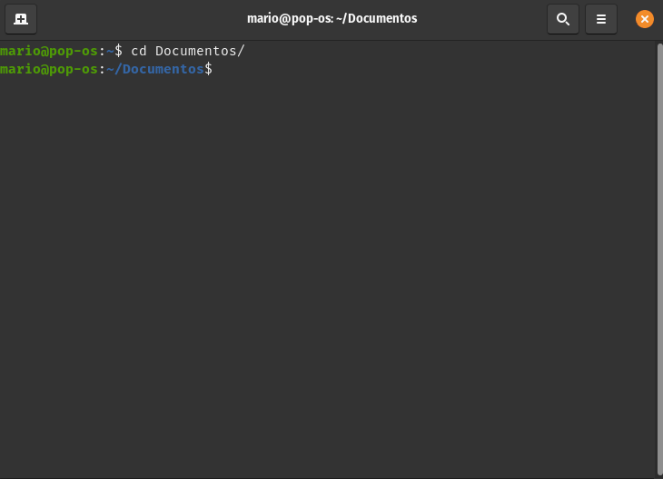

# GoShare

GoShare allows you to share files in your local network easely from your command line.

Built with Cobra and Gin, Goshare aims to be a program that can be integrated in your
day a day workflow.

# Usage 

### To-Do
- [x] Minimum work
- [ ] Capable of send various files
- [ ] Testing
- [ ] Encryption
